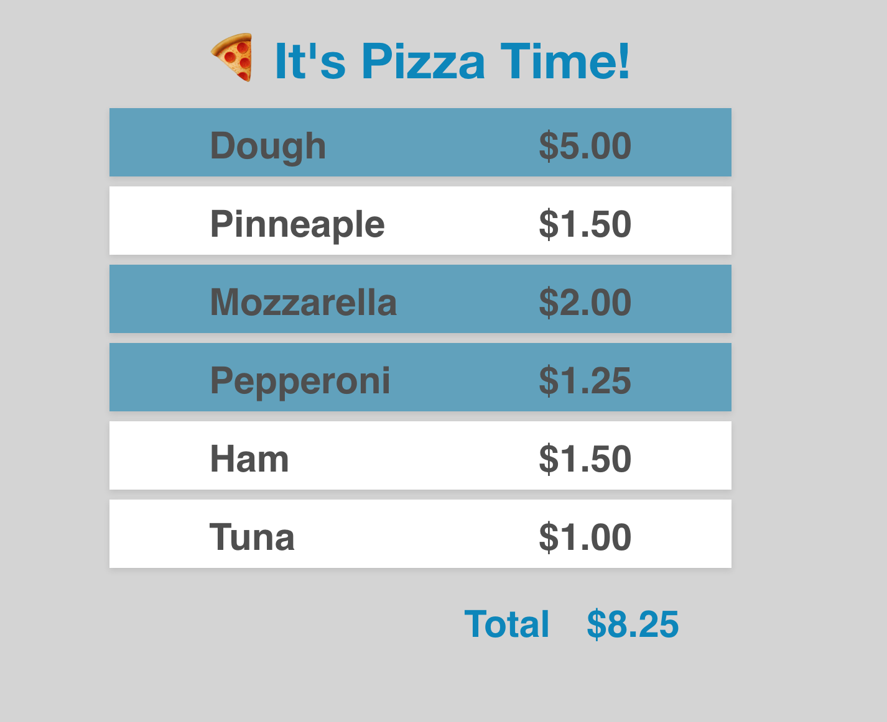

# Pizza Time

1. Fork me.
2. Clona tu versión del proyecto
3. Entra en la carpeta del proyecto
4. Instala dependencias
5. Ejecuta el script `start` o el `dev`

```
❯ git clone git@github.com:<USUARIO>/pizza-time.git
❯ cd pizza-time
❯ npm install
❯ npm start
```

## 1. La prueba

Hay 6 ficheros que tienen TODOs. Id en orden:

1. `Routes.js`
2. `Pizza.js`
3. `PizzaHeader.js`
4. `PizzaIngredients.js`
5. `PizzaIngredient.js`
6. `PizzaTotal.js`

La idea es que creeis algo parecido a 👇



## 2. La solución

Debéis comittear cada cambio localmente y como mínimo debe haber un commit por fichero-componente, en el que además del título del commit describáis a partir de la línea 3 en un par de líneas qué es lo que habéis hecho.

## 3. Pistas

Recordad que `console.log` y la extensión de React para Firefox que muestra el Virtual DOM son de gran ayuda para poder llegar a la solución.

### Happy Hacking! 😃🤖👾🚀
